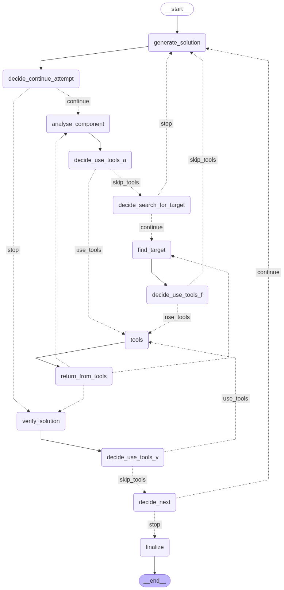

# Cryptic Crossword Solver

This project is a web application designed to solve cryptic crossword clues using an advanced LangGraph-based agent powered by OpenAI's GPT-4. The solver uses a graph structure with recurrent reasoning, specialized tools (anagram generator, dictionary lookup, etc.), and iterative analysis to produce high-quality, structured solutions and detailed reasoning.

### Graph Structure


## Example


## Project Structure

```
cryptic-crossword-solver
├── app
│   ├── __init__.py
│   ├── api.py
│   ├── get_solutions.py
│   ├── prompts
│   │   ├── reasoning_prompt.txt
│   │   └── structuring_prompt.txt
│   ├── schemas.py
│   ├── templates
│   │   └── index.html
│   ├── static
│   │   ├── css
│   │   │   └── styles.css
│   │   └── js
│   │       └── scripts.js
├── requirements.txt
├── config.py
├── run.py
└── README.md
```

## Installation

1. Clone the repository:
   ```
   git clone https://github.com/Eli-Persky/cryptic-crossword-solver.git
   cd cryptic-crossword-solver
   ```

2. Install the required dependencies:
   ```
   pip install -r requirements.txt
   ```

3. Configure your API keys and settings in `config.py`.

## Usage

1. Run the application:
   ```
   python run.py
   ```

2. Open your web browser and navigate to `http://localhost:5000`.

3. Input your cryptic crossword clue in the provided form and submit to receive potential solutions.
